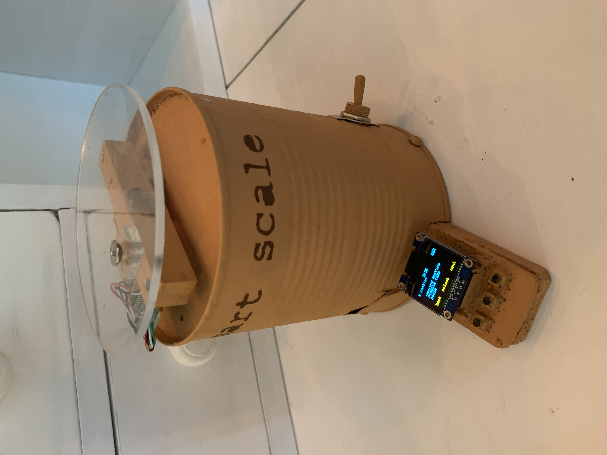
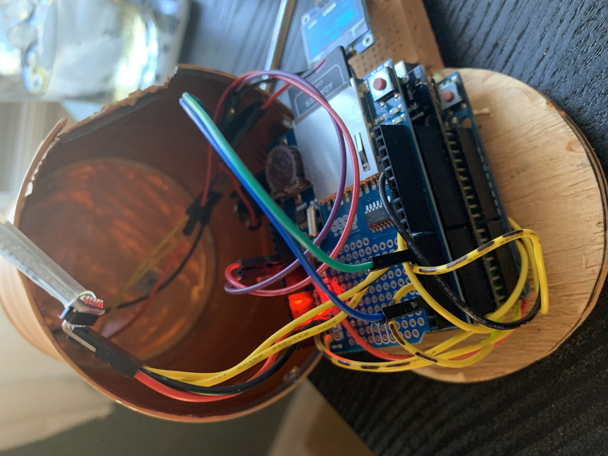
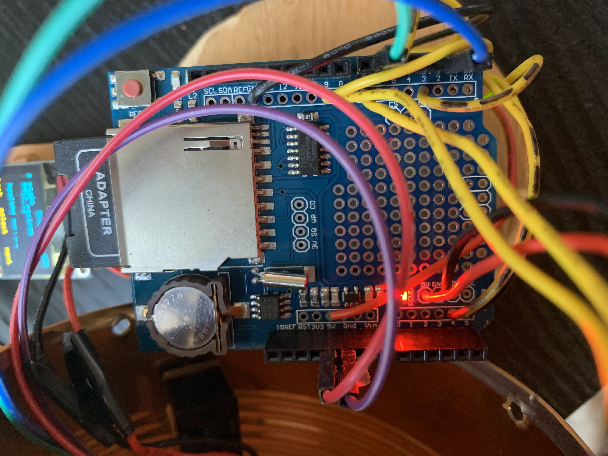
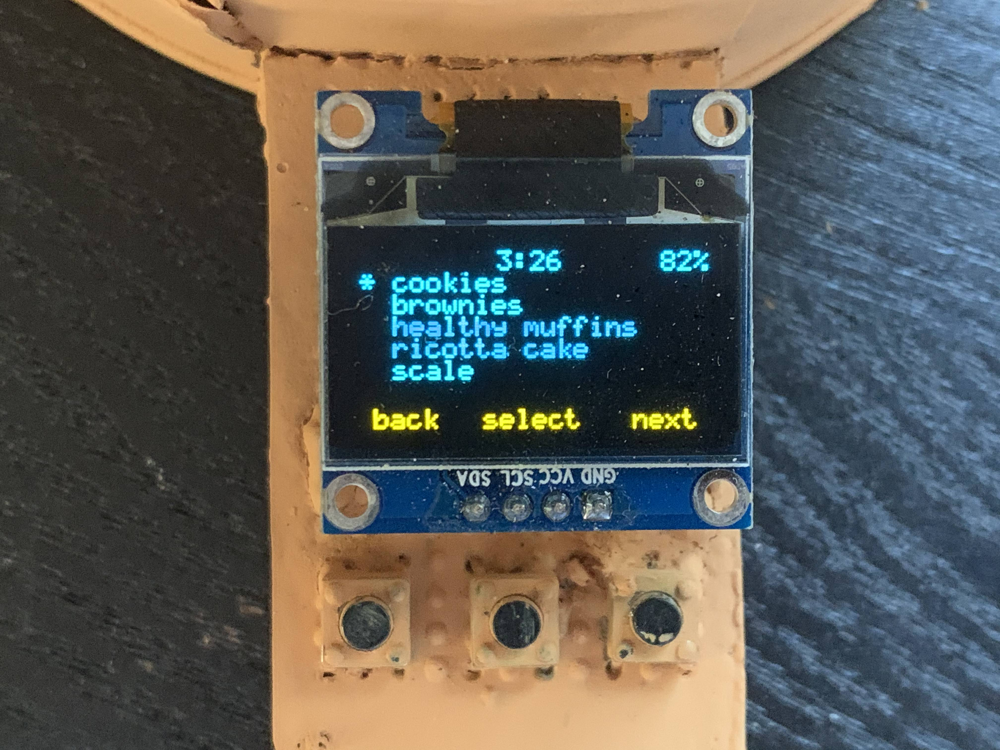
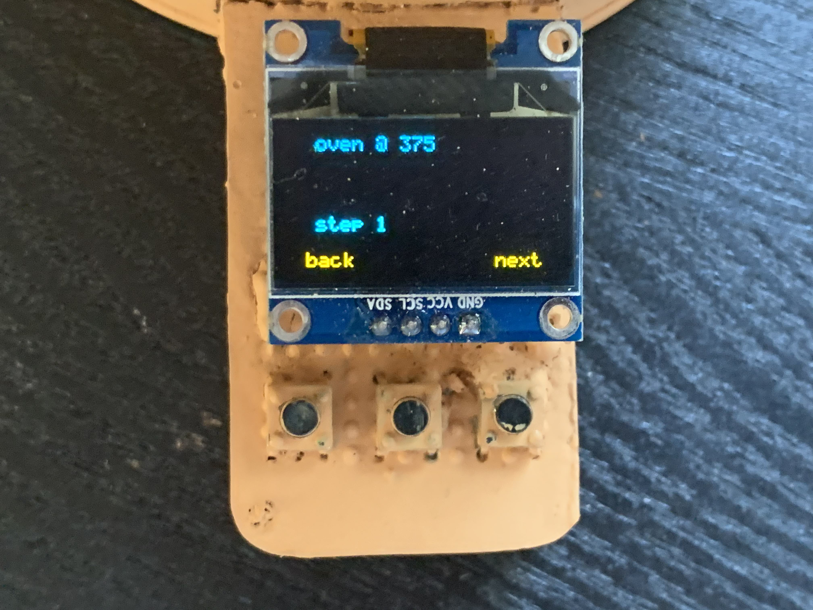
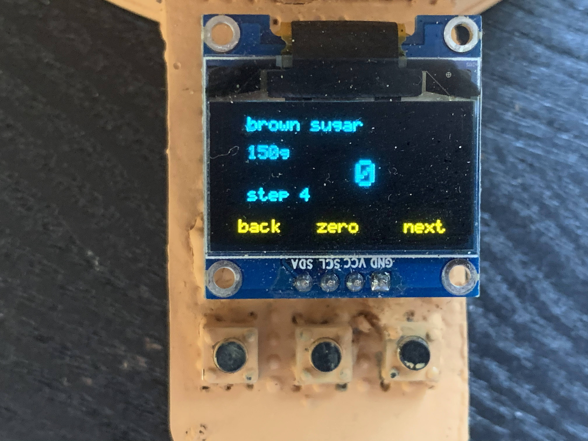
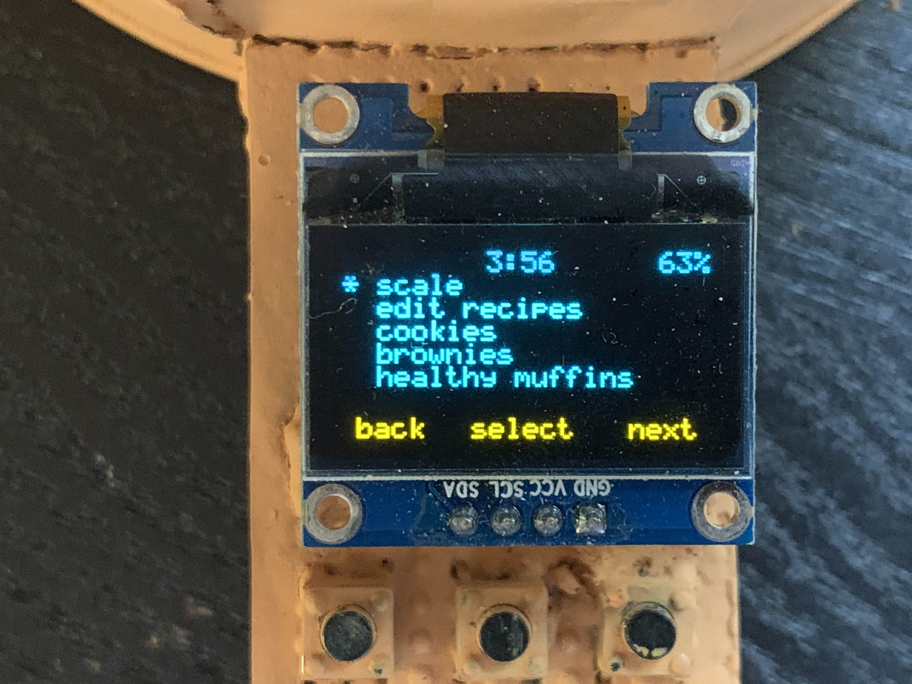
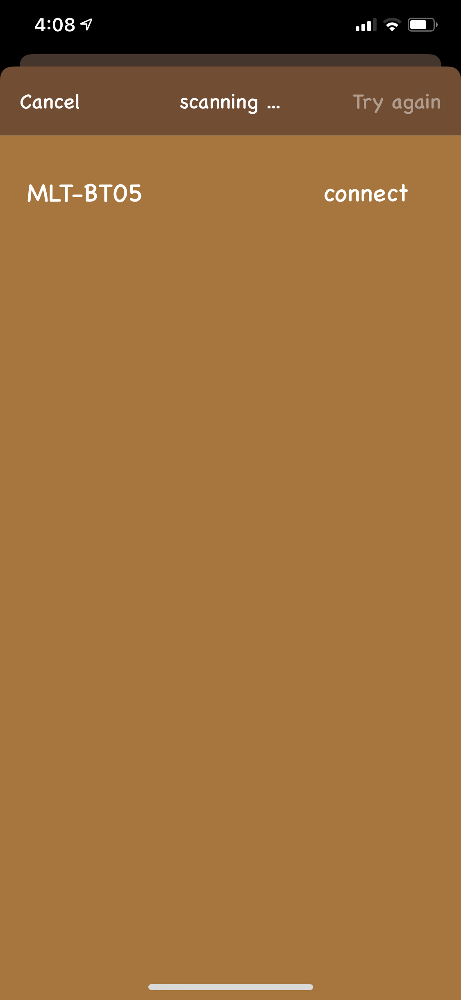
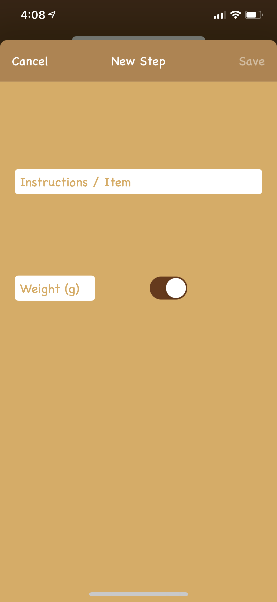

# Smart-Scale
### This project documents an interactive scale with bluetooth low energy for iPhone connectivity

#### The app is compatible with ios 13.5 and above, made possible by an adaptation of hoiberg's HM10 Serial app project (linked below), and the scale measures by the gramup to 5kg

## Hardware

The scale is controlled by a regular Arduino Uno, powered by a NightShade energy sheild (USB charging on the left), with a prototype sheild on the top for connections to sensors. The prototype sheild includes an RTC and SD card slot at pin 10, with a HX711 weight sensor attached to pins 2 and 6. To make the device wireless the device uses a HM-10 bluetooth module at pins 7 and 8, and for user interaction there is an OLED at pins A4 and A5, with three buttons at 3, 5, and 10 respectively.

## App

The app is coded with Swift 5 in Xcode 11, again using hoiberg's HM10 Serial app project (https://github.com/hoiberg/HM10-BluetoothSerial-iOS) as a starting base for communication. Through a series of table view controllers the app allows the user to see, delete, and add recipes to the scale.

## Using the scale

The scale's user interface involves the OLED for a display, as well as three buttons below it for control. The yellow text on the screen dictates what each button does. Once powered up with the switch on the left, the scale displays the time, battery level, and recipes that it currently has stored on it's SD card.

### Playing a recipe

Once a recipe is selected, the screen displays the steps one by one, with the user guiding it forward and backward if needed. Beyond the title screen, a step can either use the weight sensor (for things like water, flour, etc) or not (for instructions or things like eggs). On the end of a recipe the scale returns to the main screen.

### Editing recipes on the app

The scale can be controlled by the app by selecting 'edit recipes' from the main menu of the scale, and hitting the connect button in the app. The scale will appear (the BLE module is called MLT-BT05), and once connected the app will display any recipes on the scale.

Once connected the user can add a recipe on the top left, and can add steps and a title to create and send it to the scale. The app also implements the ios swipe to delete a recipe functionality.

Please note: beacuse of the memory-intensive libraries required for the SD and OLED, only 9 recipes can be stored at a time, and for communication reasons between devices, the characters '#' or '/' cannot be used in recipe steps or titles.
